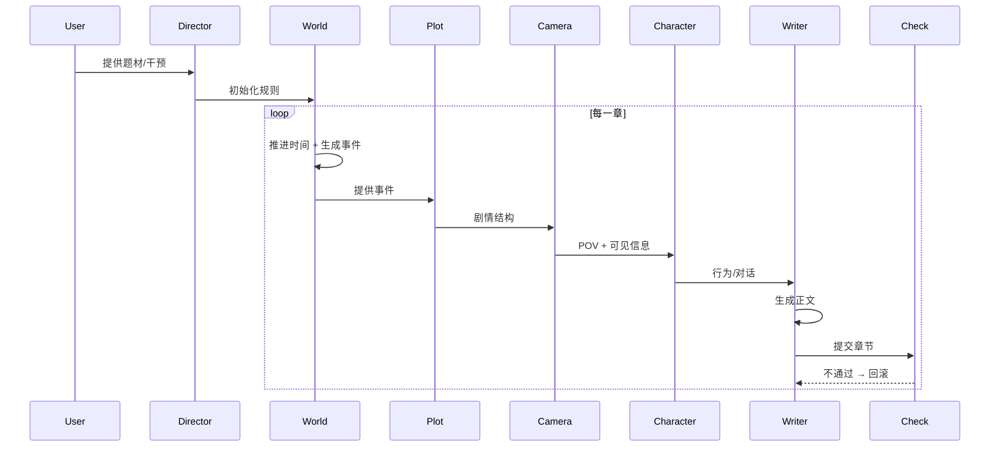
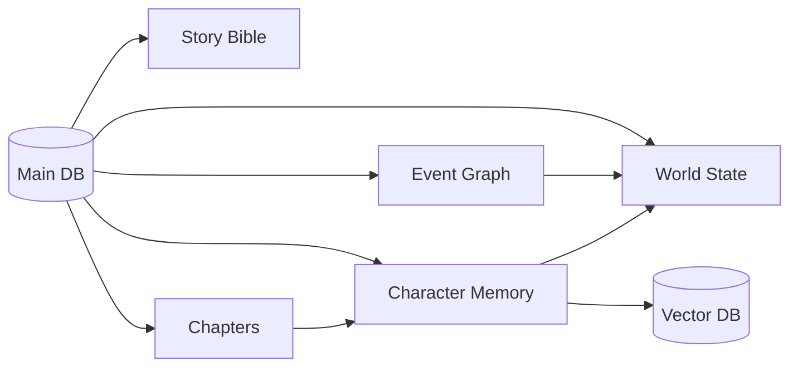
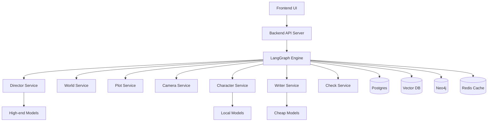

---

# 一、整体系统架构（核心骨架）

你的系统本质是一个：

> **“带持久状态的多Agent编排引擎 + 小说世界模拟器”**

可以拆成 5 层：

### 1️⃣ 控制层（Director Layer）

* 人类输入（题材/干预）
* Story Bible（世界圣经）
* 全局规则（风格/禁忌/叙事目标）

👉 本质：**配置中心 + 人类接口**

---

### 2️⃣ 编排层（Orchestration Layer）

建议用：

* LangGraph（首选）
* 或 CrewAI（更简单但弱一点）

负责：

* Agent 调度
* 状态流转
* 持久执行（长篇小说必须）
* 人类中断/回滚

👉 本质：**状态机 + DAG执行引擎**

---

### 3️⃣ 世界引擎（World Engine）

核心创新点：

* 时间线（Timeline）
* 事件 DAG（Event Graph）
* 世界状态（World State）
* 场景（Scene）

👉 这一层 = “小说版游戏引擎”

---

### 4️⃣ Agent层（演员团队）

每个 Agent 独立：

* 模型
* 记忆
* 目标

👉 真正的“多智能体系统”

---

### 5️⃣ 模型层（LLM Layer）

多模型混用：

* 强推理
* 高性价比
* 可微调

---

# 二、Agent 设计（你这个项目的灵魂）

我给你一套**工业级可扩展 Agent 列表**（不是玩具级）

---

## 🎬 1. Director Agent（导演）

职责：

* 把用户输入 → Story Bible
* 设定全局目标（本卷/本章）

模型建议：

* 强模型（推理能力）

  * GPT-5.4 / Claude Opus / Qwen3-Max

---

## 🌍 2. World Agent（世界引擎）

职责：

* 维护世界状态
* 推进时间
* 生成事件（非叙事）

输出：

```json
{
  "time": "T+3 days",
  "events": [
    {"id": "E101", "actors": ["A","B"], "impact": "war_start"}
  ]
}
```

👉 重点：**它不写小说，只“发生事情”**

---

## 🧠 3. Plot Planner（剧情规划）

职责：

* 把世界事件 → 可叙事剧情
* 拆章节结构

输出：

```json
{
  "chapter_goal": "...",
  "beats": ["冲突", "转折", "高潮"]
}
```

---

## 🎥 4. Camera Agent（你最关键的创新）

职责：

* 决定：

  * 本章视角是谁？
  * 哪些事件“上镜”？
  * 哪些不写？

输出：

```json
{
  "POV": "角色A",
  "visible_events": ["E101"],
  "hidden_events": ["E099"]
}
```

👉 本质：**叙事裁剪器**

---

## 🎭 5. Character Agents（多个）

每个角色一个 Agent：

包含：

* 性格
* 关系
* 目标
* 记忆

职责：

* 在场景中行动 & 对话

👉 注意：不要每轮喂全历史，用记忆检索

---

## 📝 6. Writer Agent（写手）

职责：

* 把：

  * 剧情 + 角色行为 + 视角
* → 生成小说文本

👉 这是“语言生成器”，不是“决策者”

---

## ✨ 7. Style Refiner（润色）

职责：

* 文风统一
* 文学性提升

---

## 🔍 8. Consistency Agent（一致性检查）

职责：

* 检查：

  * 人设崩坏
  * 时间线冲突
  * 世界规则冲突

👉 必须有，否则长篇必崩

---

## 🧪 9. Critic Agent（评分）

职责：

* 打分：

  * 可读性
  * 节奏
  * 情绪张力

👉 为未来训练准备数据

---

# 三、核心数据结构（重点！！！）

---

## 1️⃣ 世界状态（WorldState）

```json
{
  "time": 123,
  "global_flags": ["战争中"],
  "locations": {...}
}
```

---

## 2️⃣ 事件 DAG（核心）

```json
{
  "event_id": "E101",
  "time": 123,
  "actors": ["A"],
  "pre_events": ["E099"],
  "effects": ["B死亡"],
  "visibility": "partial"
}
```

👉 用 graph DB（Neo4j）或 JSON + 索引

---

## 3️⃣ 角色记忆（非常关键）

分三层：

### 短期记忆（窗口）

* 最近3~5章

### 中期记忆（摘要）

* 关系变化
* 性格变化

### 长期记忆（向量库）

* FAISS / Milvus

---

## 4️⃣ Story Bible

```json
{
  "world_rules": [],
  "power_system": [],
  "style": "黑暗奇幻",
  "taboo": ["不允许复活"]
}
```

---

# 四、章节生成状态机（执行流程）

这是你系统的“主循环”：

---

## 🧩 每一章：

### Step 1

World Agent：
👉 推进世界 → 生成事件

---

### Step 2

Plot Planner：
👉 选事件 → 生成剧情结构

---

### Step 3

Camera Agent：
👉 决定 POV + 可见信息

---

### Step 4

Character Agents：
👉 模拟行为 + 对话

---

### Step 5

Writer Agent：
👉 写正文

---

### Step 6

Refiner：
👉 润色

---

### Step 7

Consistency Check：
👉 校验，不通过就回滚

---

### Step 8

写入：

* 世界状态
* 角色记忆
* 事件图

---

# 五、模型选型（实战建议）

---

## 🎯 分层用模（非常关键）

### 🧠 高智商 Agent（导演 / 规划 / 检查）

* GPT-5.4
* Claude Opus 4.6
* Qwen3-Max

---

### ✍️ 写作类 Agent

* GPT-5.4-mini
* Claude Sonnet 4.6
* Qwen3

---

### 🎭 角色 Agent（重点）

推荐：

* 本地：

  * Llama 4
  * Qwen（可LoRA）

👉 原因：你要“训练角色”

---

# 六、角色“杀青 → 继承”设计（关键难点）

不要直接微调，正确流程：

---

## ✅ 阶段1：数据提取

```json
{
  "dialogues": [],
  "actions": [],
  "personality_changes": []
}
```

---

## ✅ 阶段2：蒸馏

变成：

```json
{
  "style": "...",
  "decision_pattern": "...",
  "speech_pattern": "..."
}
```

---

## ✅ 阶段3（可选）：训练

* LoRA（推荐）
* SFT

---

## ✅ 阶段4：新角色加载

👉 新角色 = 基础模型 + 风格偏置 + 新设定

---

# 七、MVP（你现在就能做的版本）

我帮你压缩到一个**2周能跑的版本**：

---

## 🔧 技术栈

* 编排：LangGraph
* 模型：

  * GPT-5.4-mini（主力）
  * Qwen（本地角色）
* 向量库：FAISS
* 存储：SQLite + JSON

---

## 🎯 只做这几个 Agent：

* Director
* World
* Plot Planner
* Camera
* Writer
* Consistency

👉 不要一开始全做

---

## 🎬 MVP流程：

```text
输入题材
→ 生成Story Bible
→ 循环：
    世界推进
    选一个事件
    选视角
    写一章
    校验
```

---

# 八、我给你的关键判断（很重要）

### ✅ 真正难点不是：

* 多Agent（已经有框架）
* 写小说（模型很强）

### ❗ 真正难点是：

1. 长期一致性
2. 角色不崩
3. 事件不乱
4. 不重复剧情

👉 解决方案不是更大模型，而是：
**状态系统 + 约束 + 审查 + 回滚机制**

---

完整架构图（工程级）

# 🧱 一、总体架构图（核心系统）

```mermaid
flowchart TD

    %% ===== 用户层 =====
    U[User / 导演输入] --> D[Director Agent]

    %% ===== 控制层 =====
    D --> SB[Story Bible]

    %% ===== 编排层 =====
    SB --> ORCH[Orchestration Engine (LangGraph)]

    %% ===== 世界引擎 =====
    ORCH --> WA[World Agent]
    WA --> WS[World State]
    WA --> EG[Event DAG]

    %% ===== 剧情层 =====
    ORCH --> PP[Plot Planner]
    PP --> CP[Camera Agent]

    %% ===== 角色层 =====
    CP --> CA1[Character Agent A]
    CP --> CA2[Character Agent B]
    CP --> CA3[Character Agent ...]

    %% ===== 写作层 =====
    CA1 --> WR[Writer Agent]
    CA2 --> WR
    CA3 --> WR

    WR --> RF[Refiner]
    RF --> CC[Consistency Check]
    CC --> CR[Critic]

    %% ===== 输出 =====
    CR --> OUT[Chapter Output]

    %% ===== 数据回写 =====
    OUT --> WS
    OUT --> EG
    OUT --> MEM[Memory System]

    MEM --> CA1
    MEM --> CA2
    MEM --> CA3
```

---

# ⚙️ 二、Agent执行时序（每一章怎么跑）



---

# 🧠 三、数据层架构（核心存储设计）



---

## 📦 数据拆分（工程建议）

### 1. 世界状态（强一致）

* SQLite / PostgreSQL

### 2. 事件 DAG

* Neo4j（推荐） or JSON Graph

### 3. 角色记忆

* 短期：Redis
* 长期：Vector DB（FAISS / Milvus）

### 4. 章节

* 文本存储（对象存储 or DB）

---

# 🧩 四、技术部署拓扑（真实怎么跑）



---

# 🧠 五、关键工程决策（非常重要）

---

## 1️⃣ Agent必须“无状态 + 外部记忆”

❌ 错误：

* 把所有历史塞进prompt

✅ 正确：

* 状态存在 DB + Vector
* Agent 每次按需检索

---

## 2️⃣ 世界引擎必须独立

👉 不要让 Writer 决定世界

否则：

* 世界会崩
* 逻辑会乱

---

## 3️⃣ Camera Agent 是核心差异点

它决定：

* 小说“像不像小说”
* 是否有“叙事节奏”

---

## 4️⃣ 一致性检查必须强制

```text
不通过 → 回滚 → 重写
```

否则长篇一定崩

---

## 5️⃣ 必须支持“中断 + 修改 + 重跑”

👉 用 LangGraph 的：

* checkpoint
* human-in-the-loop

---

# 🚀 六、你可以直接怎么开干

---

## 🥇 第一步（1-2天）

搭骨架：

* LangGraph
* 6个Agent（最小版）
* JSON存储

---

## 🥈 第二步（3-5天）

实现：

* 世界状态
* 事件DAG
* 简单记忆

---

## 🥉 第三步（1周）

优化：

* Camera Agent
* Consistency Check
* 角色记忆

---

# 🔥 最后给你一句关键建议

项目成败取决于：

> ❌ 不是模型多强
> ✅ 而是“系统是否像一个游戏引擎一样运行”

---
